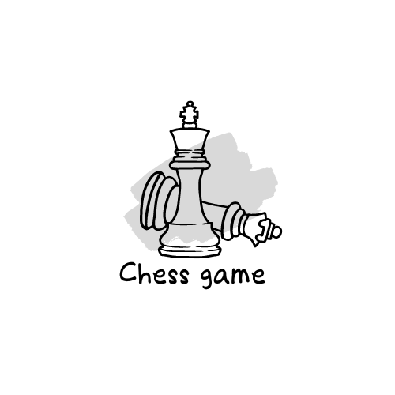
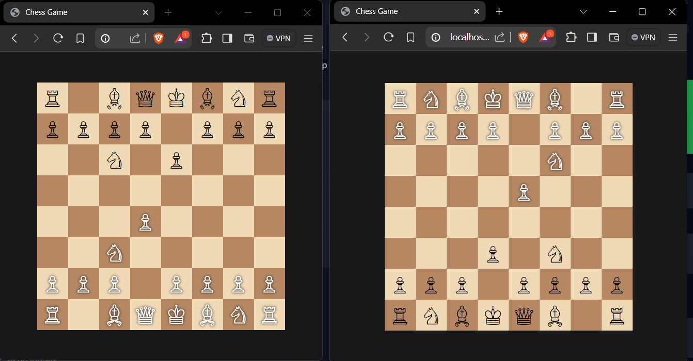

<!-- PROJECT LOGO -->
 

  

<h3 align="center">Chess Game</h3>

  

    Backend of a Chess Game
    
  

<!-- ABOUT THE PROJECT -->
## About The Project

• Developed a chess game backend with Express.js, chess.js, and Socket.io for core mechanics and real-time
communication. 
• Integrated JavaScript drag-and-drop functionality for dynamic piece changes and movement. 
• Implemented secure and efficient API endpoints using Express.js and Socket.io for game state, player moves
and player-turn.

### Built With

 

 
And ChessJS

<!-- CONTACT -->
## Contact

13102003y@gmail.com
 
Project Link: [https://github.com/yashkumar13/chessgame-backend]

